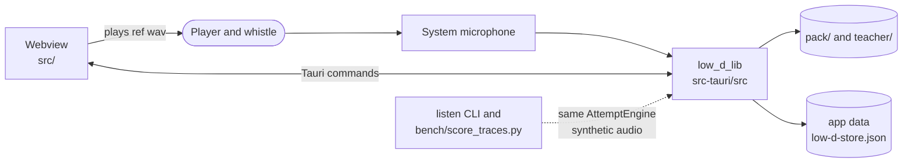
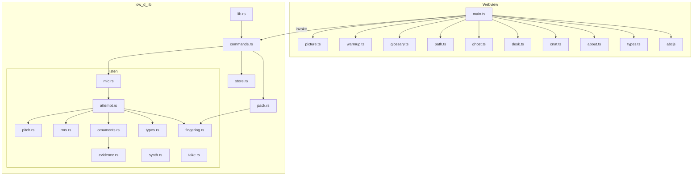
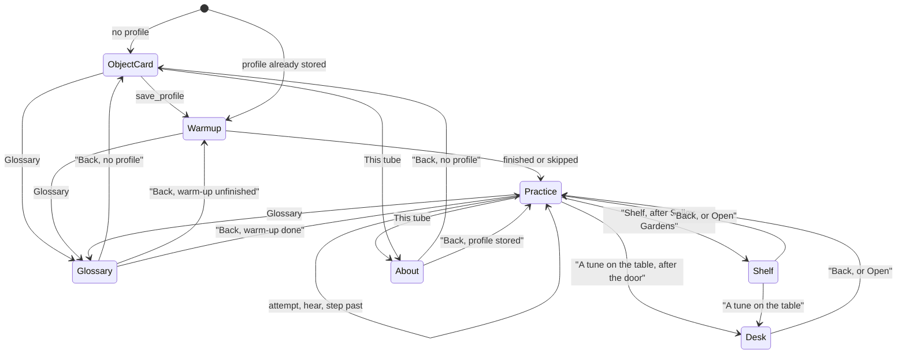
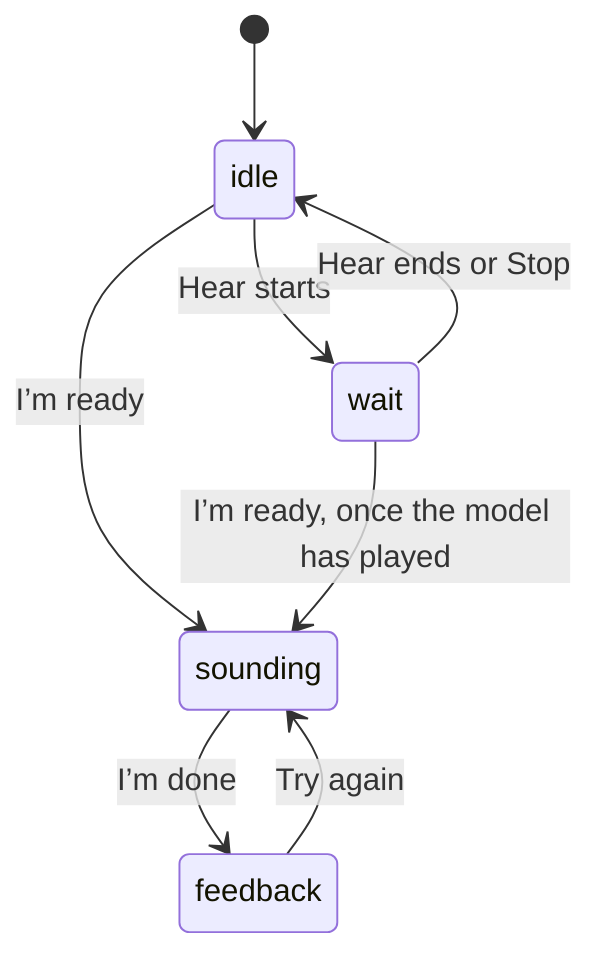
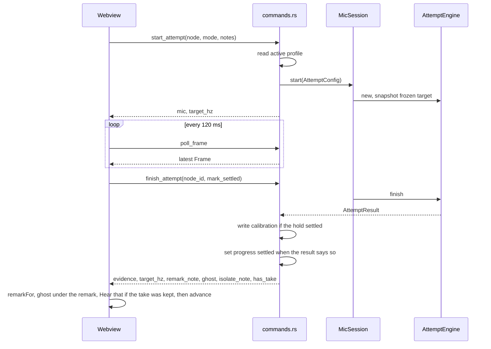
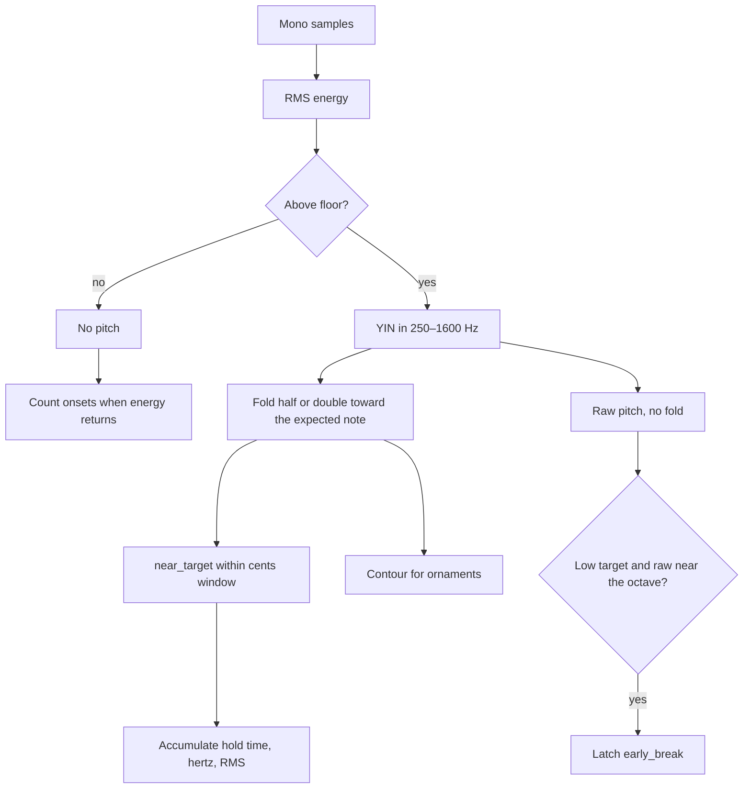
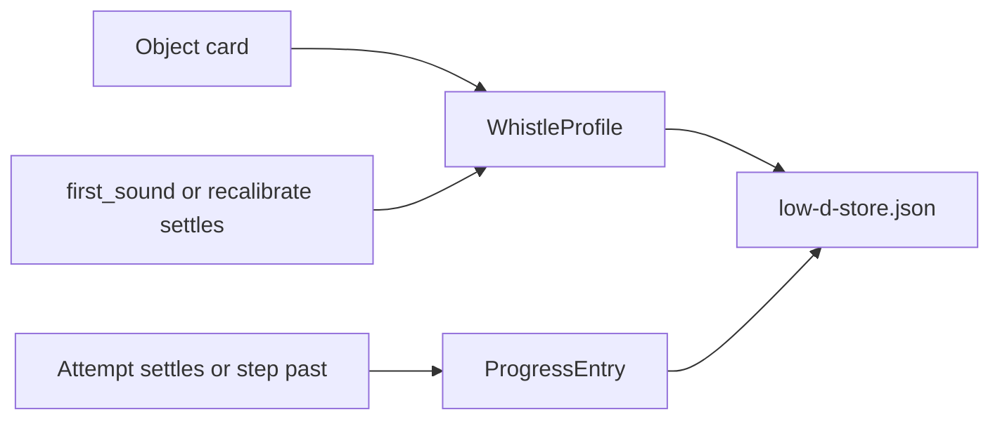

Type: ARCHITECTURE
Authority: How the running app is shaped — processes, modules, data flow, and where a change lands. Product rules (who it is for, the path, listen states, storage meaning, rights) live in [CONCEPT.md](CONCEPT.md). What is in the build today lives in [FEATURES.md](FEATURES.md).

# Architecture

Low D is a desktop app. A Vite webview draws the practice screen. A Rust library (`low_d_lib`) owns the microphone, the pitch tracker, the attempt, the pack, and the on-device store. Nothing in that path calls a server.



The bench is a second binary over the same engine. It is not linked into the window.

## Processes

| Piece | Where | What it does |
| --- | --- | --- |
| `low-d` | `src-tauri/src/main.rs` → `low_d_lib::run` | Tauri window. Product name Low D, identifier `com.lowd.practice`. |
| Webview | `index.html`, `src/main.ts` | Object card, warm-up, practice, glossary, shelf, desk, the “this tube” page, hole picture, staff, remark, and the phrase line under the remark. |
| `listen` | `src-tauri/src/bin/listen.rs` | Writes fixtures, grades one named fixture, runs the synthetic gate, or scores a wav from a sidecar. |
| Vite | `vite.config.ts` | Dev server on port 1420. HMR uses 1421 when `TAURI_DEV_HOST` is set. |

`tauri.conf.json` runs `npm run dev` before `tauri dev` and `npm run build` before a bundle. The bundle copies the `pack/` directory in as a resource. macOS `Info.plist` carries the microphone usage string: audio stays on the device.

The window starts at 960×720, and will not shrink below 720×560. Capabilities on the main window are `core:default` and `opener:default`. The opener plugin is registered. Hedwig’s letter-note button and a Session link on the shelf call `openUrl`.

## Modules



| Module | Owns |
| --- | --- |
| `src/main.ts` | Screen state: which pack, which node, which stair note, which phrase, listen pill, Hear and Slower, the review, polling, warm-up, glossary, shelf, desk, the tube page. |
| `src/path.ts` | The practice rail, the note-or-phrase row, which step a sitting reviews, and when Hear is the primary action. It does not write progress. |
| `src/ghost.ts` | The phrase line drawn under the remark after feedback. |
| `src/desk.ts` | The one-folder desk. It does not load packs. |
| `src/cnat.ts` | The second C-natural picture, offered only after this stick disagrees. |
| `src/about.ts` | The “this tube” page: whistory, the transposition refusal, and a name-only list. Wording is ours; the rules are in [CONCEPT.md](CONCEPT.md). |
| `src/glossary.ts` | Glossary copy and the word list: whistle, ornaments, tune types. |
| `src/picture.ts` | The low-D drawing: the tube, a column per note when the step has several, the hole a cut or tap moves, the letter and its sol-fa, and the reader’s sol-fa again under the staff. |
| `src/warmup.ts` | The hands-and-breath pass. It is not stored. |
| `src/preview.ts` | Dev-only picture fixture. `tauri dev` with `?preview=picture`. |
| `src/path-preview.ts` | Dev-only rail fixture. `?nav`. |
| `src/types.ts` | Webview types, a fallback copy map, and which remark sentence to show. |
| `commands.rs` | Tauri commands and `AppState`. |
| `pack.rs` | The catalog: every pack folder, the chain, and reference paths inside `ref/*.wav`. |
| `store.rs` | `low-d-store.json`: profiles and progress. |
| `listen/mic.rs` | cpal input on its own thread. The stream is not `Send` on macOS, so the thread holds it and the rest of the app holds `Arc` handles. |
| `listen/attempt.rs` | Hop windows, frozen target, evidence at the end of an attempt, the note a phrase fault names, and the capped take. |
| `listen/pitch.rs` | YIN tracker, band about 250–1600 Hz, plus a search near the expected note. |
| `listen/rms.rs` | Energy of a window, used as a breath proxy. |
| `listen/ornaments.rs` | Cut, tap, roll, short roll, slide, cran, double tap, and triplet on a pitch contour. Messy contours abstain. |
| `listen/synth.rs` | Sine, noise, the named fixtures, and a wav in memory for the last take. The practice screen plays that wav. It is not written to the store. |
| `listen/take.rs` | Grades one wav against a sidecar: mode, notes, expected evidence, whether it should settle. |
| `listen/types.rs` | Note names through B5, cents, profile struct, tolerances. |
| `listen/fingering.rs` | The hole chart the pack is checked against, and which single hole a leak names. |
| `listen/evidence.rs` | Evidence enum and the four listen-state names. |

`AppState` holds the catalog, the pack on screen, the store directory, the live `MicSession`, the frozen target hertz for the attempt on screen, and the last take. The take is wav bytes in memory. `drop_attempt` and the next `start_attempt` clear it. `read_last_take` returns those bytes. A couldn’t-hear and an abstain store nothing.

## Startup

`run` loads every manifest under `pack/`, and under a sibling `teacher/` directory when that folder exists. The door is `may-morning-dew`. If that catalog cannot be loaded, startup panics. Setup searches the working directory, the Cargo manifest’s `pack/`, and the bundled resource directory, and replaces the catalog when it finds the door.

The webview calls `get_catalog`, opens the earliest pack that is open and not yet settled, then `get_pack` and `get_store`. A saved `active_profile_id` skips the object card. Every launch then runs the warm-up, which is kept only in memory, and then opens practice on the first unsettled node of that pack. The rail opens every node in the pack. Leaving a node or a step calls `drop_attempt`, which releases the microphone and writes nothing.

A folder under `teacher/` is loaded beside `pack/`. One bad teacher folder is remembered and skipped. It does not drop the door. The desk lists those folders, and the refusals, once `may-morning-dew` is settled. `open_pack` refuses a teacher pack before that.

Dev query flags, with `tauri dev`: `?preview=picture`, `?warmup`, `?glossary`, `?nav`.

## Screens



The object card asks for a nickname (default “this horn”), whether the player reads (`no` / `some` / `yes`), and background (`none` / `wind` / `other` / `high_d`). It draws the low D with every hole closed. Hands and breath calls `save_profile`, which writes a profile with `break_hz` and `rms_floor` at 0 and makes it active. A whistle already stored can be chosen from this card. There is no microphone test on this card.

The warm-up is one pass: hands and wrists, both hands, then a counted hiss. Begin starts it. Next skips the current exercise. Pause holds the clock. Ease off skips the rest. To the whistle opens practice. Nothing from this pass is written. Glossary pauses a running pass and resumes it on Back.

Practice shows the whistle’s nickname, the pack title, a rail of that pack’s nodes (each one can be opened), and the node’s copy from the pack. Inside a staircase, the octave, and a phrase, a second row opens a single note or line. Listen nodes add a listen pill, the hole picture, an optional staff, one remark, a line under that remark after feedback, a hold bar, and the target line (the frozen hertz and this whistle’s break, or, before calibration, that the listen is only whether low D is there). Between attempts the card can change reading and background, and, once a break is stored, start a recalibrate hold. After the door pack is settled, “A tune on the table” opens the desk. A page node such as `hedwig` does not start an attempt. `vibrato` is the same kind of page. Copy for `high_d` replaces the pack’s `high_d_body` when that field is set. Wind players only change the “restarted notes” remark, via `remarks.json`. Song words, when the pack has them, show after Hear or after the line has been played, and can hide. A dance pack’s pulse button clicks a count; it is not sent to the engine.

Glossary is a word list in the webview: the whistle, ornaments, and tune types. Search filters it. Back or Escape returns to the screen that opened it. An attempt already running is left running.

Buttons:

| Control | When it shows | What it does |
| --- | --- | --- |
| I’m ready / I’m done / Try again | Listen nodes | Starts an attempt, ends one, or clears feedback and starts again. |
| Letter notes in D | A page node with an https URL | `openUrl` on that page. |
| I’ve played the opening / I’ve heard it / Not yet — continue | Page nodes, including `hedwig` and `vibrato` | Marks the node settled (`stepped`) and moves on. Nothing was graded. |
| Hear / Slower / Stop | A `ref/*.wav` exists for this step | Hear plays that file. Slower plays a phrase or a held note at three-quarter speed. An ornament demo is full speed only, so a cut is not stretched into a note. While Hear plays, it becomes Stop and Slower hides. Grading is off for the duration. |
| Recalibrate | A break is stored, and no attempt is open | Starts a low-D hold. On settle, writes `break_hz` and `rms_floor` once. Does not mark the node on screen. |
| Reading / Background | A profile exists, and no attempt is open | `update_profile_answers`. Pictures and the remark change. The break does not. |
| Hear the pulse | The pack’s `pulse_beats` is greater than zero | Plays a short click pattern in the webview. The engine does not hear it. |
| Couldn’t hear — continue | Listen nodes | Marks the node settled and moves on. |
| Hide pictures | The node sets `hide_pictures` | Clears the hole picture and the staff. |
| Hide words | The current line has words | Clears or shows that line. |
| Next | The pack’s nodes are settled and a later pack is open | `open_pack` on that id. |
| Shelf | `salley-gardens` is settled | Index of packs. Open calls `open_pack`. A Session URL calls `openUrl`. |
| This tube | Name card and practice | The page in `about.ts`. |
| Another whistle | Practice, and the name card when a profile exists | Selects a stored profile, or returns to the name card. |
| Practice rail | Always | Opens that node. Releases the microphone if an attempt or Hear was running. Writes no progress. |
| Note or phrase | Staircase, octave, and phrase nodes | Opens that note or phrase. Low D and Octave switch the expected note between D4 and D5. Same release, no progress write. |

Letter names on the holes come from the fingering file, and the fixed-do syllable sits beside each letter. The staff is abcjs, and only when `reads` is `some` or `yes`, the player has pressed Hear or Slower on this phrase, pictures are showing, and the node mode is `on_the_breath` or `phrase`. The header uses the pack’s meter and key. Under that staff the webview adds the letter names and the sol-fa from the concept. A cut, tap, or roll marks the hole that moves, on the tube and on that note’s column. Node prose lives on the pack’s `nodes`. `NODE_COPY` in the webview is the fallback when a node has no copy of its own.

## Listen states on screen

The pill uses the four names from the concept. The webview sets them; the engine does not push a state enum.



Hear calls `set_grading` with grading off, so the capture callback drops samples and the app cannot grade its own speaker. When a reference wav is on disk, Hear is the primary action until that file has finished once. I’m ready then starts the attempt. A later replay can still be cut short by I’m ready. A missing wav does not block the step. Tones, when Hear uses them, are not that gate.

While an attempt is open the webview polls `poll_frame` every 120 ms. I’m ready sets the pill to `sounding` as soon as the microphone opens. A frame repaints the whistle, the current column, and a leak ring when the frame names one hole. The poll does not rebuild the practice card. The hold bar is the engine’s `hold_ratio` on the first sound (10 s), the staircase (0.8 s), and the octave (2 s low, 1.5 s up). On the first sound, a quiet stretch longer than about 0.3 s walks that hold back. An `early_break` frame on the low hold writes that remark immediately; the attempt’s target is left as it was.

## One attempt



`start_attempt` drops any previous session first. The config’s sample rate is replaced by the device rate. Hop length stays 30 ms (10 ms on the ornament fixtures in the bench). If the microphone will not open, the command returns `ok: false` and `mic: false`, and it does not mark the node started. The screen stays `idle` and shows the couldn’t-hear remark. Finish with no session yields `couldnt_hear`.

The engine freezes `target_hz` when the attempt is constructed. Later notes in a phrase are intervals from `break_hz` (or from 293.66 Hz when the profile has no break yet). Finish returns that same snapshot. The webview logs a warning if the returned target differs from the one it stored by more than half a hertz. Recalibrate starts a new `first_sound` hold between attempts. It does not move the target of an attempt already running. On settle it writes the profile once and does not mark the node on screen.

### Modes

The webview picks the mode from the pack node. The door’s nodes use the modes below. A later pack reuses the same modes with its own notes.

| Mode on the node | Engine mode | Expected sound |
| --- | --- | --- |
| `first_sound` | `first_sound` | Low D, wide tolerance until a profile exists |
| `staircase` | `single_note` | The current stair note |
| `breath_octave` | `breath_octave` | D4, or D5 when Octave is selected |
| `page`, `vibrato` | none | No attempt. A URL, when the node has one, opens in the browser. The settle button calls `step_past`. |
| `on_the_breath` | `on_the_breath` | The line in `phrases.json` |
| `phrase` | `phrase` | Notes of the current chunk, plus any breath indexes and ornament marks on that chunk |
| `ornament` | `ornament` | The node’s note, or the pack’s demo note, and the node’s gesture |

`mark_settled` is false while the staircase or an air still has a later note or chunk. The engine can still report the attempt settled; progress for the node is written only when this flag is true. The webview then advances the stair index or the phrase index on its own.

Couldn’t hear — continue calls `step_past`, which writes `settled` for the node even when the engine heard nothing, then moves to the next node.

### Inside a window

Each hop keeps two hops of audio for the tracker.



Before calibration the cents window is 80. After `break_hz` is set it is 50. An early break is a raw pitch within 80 cents of twice the break (or of 293.66 Hz), and only on `first_sound` and on `breath_octave` while Low D is selected. Score-guided tracking can fold that octave back to the low target; the raw estimate is what latches the break, so the remark can still fire. A target at the break or above counts raw frames on the same fingering an octave down; when those are most of the attempt, the evidence is `cracked`.

`rms_floor` written at calibration is a quarter of the mean energy of the held note, and at least 0.008. A window counts as sounding when its RMS is at least 1.4 times that floor. Until a floor exists, the stand-in floor is 0.01.

### What finishes an attempt

`decide` returns one evidence value. Fewer than three voiced frames, or a contour that is mostly low-confidence while energy is present, becomes `couldnt_hear`.

| Mode | Evidence the engine can return | Settles the attempt |
| --- | --- | --- |
| `first_sound` | `early_break` if the break latched before 10 s; `low_d_held` at 10 s on the target; otherwise `sealed` | `low_d_held` |
| `breath_octave`, stay low | `early_break`, or `low_d_held` after 2 s, or `sealed` | `low_d_held` |
| `breath_octave`, find octave | `octave_there` after 1.5 s on the upper D; otherwise `couldnt_hear`. `decide` also has a `broke_early` branch, and the latch that would feed it is set only while the target is the low D | `octave_there` |
| `single_note` | `note_found` after 0.8 s; `still_d` when a higher note was asked and most frames are still the break; `cracked` when the note is at the break or above and the raw pitch sat on the lower octave; else `sealed` | `note_found` |
| `phrase` | `phrase_ok` when every note has been held, in order, for about 120 ms. A gap that is not one of the chunk’s breath indexes is `breath_chops`. A marked gesture that is clearly too long, or a tap that does not arrive, or a short roll that splits, replaces `phrase_ok`. A messy mark stays silent and the phrase can still settle. A scramble does not settle. `couldnt_hear` when fewer than three frames were near the target; else `sealed` | `phrase_ok` |
| `on_the_breath` | `restarted_notes` when onsets are at least as many as the notes; `phrase_ok` when many frames sit near the target; `let_them_join` otherwise, once a few frames were near it. The phrase index walks this line in order too, so “near the target” follows the note they are on | `phrase_ok`, `let_them_join` |
| `ornament` | `cut_too_long`, `tap_missing`, `became_notes`, `slide_missed`, or `abstain` | `abstain` |

`low_d_held` on `first_sound` is the only path that returns a new `break_hz` and `rms_floor`. `finish_attempt` writes those onto the active profile and sets `cal_as_of`. A recalibrate attempt is that same hold between other nodes: the frozen target stays the old break, a steady low note may sit sharp of it, and progress for the node on screen is not written. When the open pack is `c-natural`, the node is `cnat_hold`, and that attempt settles by ear, `finish_attempt` writes `cnat_id` from the manifest onto `cnat_fingering`, or `oxxoxx` when the screen had offered that second picture. Stepping past does not. Audio samples are not written.

`finish_attempt` also returns a ghost: at most 64 points of time and cents from the frozen target, plus the expected note spans. It is omitted for `couldnt_hear` and `abstain`. The webview draws it only in feedback.

Ornament success is `abstain`: the remark table’s string for it is empty, and the attempt still counts as settled. `cut_too_long`, `tap_missing`, `became_notes`, and `slide_missed` do not settle. A roll wants a short upward blip and then a short downward blip, each under about 70 ms, on a body that is still the expected pitch. A short roll uses that parser and treats a gap in the body as two notes. A slide that moves and finishes away from the note is `slide_missed`; otherwise it abstains. Cran, double tap, and triplet abstain unless a blip lasts long enough to be its own note. Large swings in the contour abstain.

Phrase tracking walks the chunk in order. A note counts after it has dwelt about 120 ms; the next note does not count until that dwell is done. The highlighted index stays on the note they are still playing. The search stays around the pack’s notes. There is no open transcription. A frame also carries `hold_ratio` (`hold_secs` over the settle that mode requires) and `leak_hole` when the heard scale note differs from the expected one by exactly one hole. Two holes, or the same fingering an octave up, name no hole.

## Remarks

Evidence is a snake_case id. `remarks.json` maps each id to a small set of sentences. `remarkFor` picks in this order: a sentence keyed by the note name (`remark_note`, set for single-note attempts), then `high_d`, then `wind`, then `reads_yes` when the player reads a little or well, then `default`.

The screen shows that one sentence. It does not show a percentage, a streak, or a letter.

## Pack on disk

The loader reads every `pack/*/manifest.json`, and a `teacher/` folder beside `pack/` when that folder exists. Playable packs have `rights` `pd`; from wave 2 they also carry a named `source`. The chain order and the rights ledger are in [CONCEPT.md](CONCEPT.md). `page_only` loads as a title: the loader rejects `tune.abc` and any wav under `ref/`. `after` names the pack, or `pack/node`, whose progress is `settled` before `catalog_view` marks this pack open. Progress rows carry `pack_id`. Older rows are read as `may-morning-dew`.

```
pack/<id>/
  manifest.json
  phrases.json
  tune.abc
  fingering-low-d.json
  ornaments.json
  remarks.json
  words.json          # song packs
  ref/*.wav
```

`manifest.json` fields the loader keeps include `id`, `version`, `track`, `title`, `node_ids`, `nodes`, `pages`, `content_hash`, `wave`, `after`, `book_ref`, `shelf`, `rights`, `aka`, `source`, `session`, and `pulse`. The hash covers those fields, each page, each node, and the content files that are present. `load_pack` refuses a mismatch. A `page_only` pack with a tune or a wav is refused. `phrases.json` on the door holds four chunks of *The May Morning Dew*. Later packs hold their own lines. The staff draws the chunk’s abc, in the pack’s meter and key. `fingering-low-d.json` is six holes, top to bottom `L1`…`R3`. The loader checks each note the pack asks for against `listen/fingering.rs`. Notes above the break use the same holes and octave 2, through B5. Ornament marks on a phrase are drawn, and graded when the node says so. A cut on a later pack is graded only after `orn_cut` on the door has settled. `ref/` is the only place `read_ref` will read.

Held notes `D4.wav` through `B4.wav` and `D5.wav` are in the tree. Phrase recordings and ornament demos are named by the app and are not in the tree yet; Hear plays the pack’s notes as plain tones for those steps until a wav is there. Where the held notes came from is in `pack/may-morning-dew/ref/README.md`.

## Store on device



Path: the Tauri app-data directory, file `low-d-store.json`. A missing file loads as an empty store. A file that will not parse is renamed to `low-d-store.json.bak-<stamp>` and that load returns an error; the next load, finding nothing, is empty. Writes go to `low-d-store.json.tmp` and then rename over the store.

```json
{
  "profiles": [
    {
      "profile_id": "uuid",
      "label": "this horn",
      "break_hz": 0,
      "rms_floor": 0,
      "cal_as_of": "",
      "reads": "no",
      "background": "none",
      "cnat_fingering": null
    }
  ],
  "active_profile_id": "uuid",
  "progress": [
    { "profile_id": "uuid", "node_id": "first_sound", "pack_id": "may-morning-dew", "state_reached": "started", "as_of": "RFC3339", "via": "" }
  ]
}
```

`state_reached` is `started` (when an attempt opens) or `settled`. A later `started` does not downgrade `settled`. `via` is `heard` when the loop settled the node, and `stepped` when the player moved on unheard. `stepped` does not replace `heard`. Progress is stored per `profile_id` and `pack_id`. An old flat list is attached to the active profile once, and an empty `pack_id` becomes `may-morning-dew`. `cnat_fingering` stays empty until `c-natural` settles by ear. The name card calls `save_profile` and `select_profile`. Practice calls `select_profile` when more than one whistle is stored, and `update_profile_answers` when reading or background changes. Progress writes go through start, finish, and step. A recalibrate finish writes the profile and does not write progress.

## Notes and targets

`NoteName` runs from D4 through B5: D4, E4, F♯4, G4, A4, B4, C5, C♯5, D5, then E5, F♯5, G5, A5, B5. A target is `break_hz * 2^(semitones/12)`. C5 is ten semitones up. E5 is fourteen. The door’s phrases do not ask for C or for anything above D5. Strings `F#4`, `Fs4`, `C#5`, `Cs5`, `D'`, `F#5`, and `Fs5` are accepted at the command boundary. A pack key outside D, Dmaj, Ador, Ddor, Dmix, Edor, Em, and Emin is refused by the loader.

## Bench

`listen` does not open the microphone.

| Subcommand | Effect |
| --- | --- |
| `fixtures` | Writes `bench/fixtures/<name>.wav` and `bench/out/<name>.trace.json`, plus `summary.json`. |
| `grade <name>` | Prints evidence for `steady_low_d`, `early_break`, or `noise`. Other fixture names are written by `fixtures` and scored by the Python script; `grade` does not accept them. |
| `gate` | Settle, early break with the same target, retry, a short phrase, then noise that does not settle. Prints `GATE PASS` or asserts. |
| `grade-take <sidecar.json>` | Scores the wav named by that file. Prints evidence, whether it settled, and whether that matches the sidecar. Exit 1 on a mismatch. |

`bench/score_traces.py` reads `summary.json` and checks evidence and `settled` against a table in that file. A short cut comes back `abstain` and settled. A cut that lasts does not. The human steps are in [bench/HUMAN_GATE.md](bench/HUMAN_GATE.md). `corpus/` is a place for labeled takes from a real player; those files are gitignored and the Python scorer does not grade them. `listen grade-take` does, when a sidecar names the wav. Two synthetic sidecars in `bench/takes/` are graded by `cargo test`.

Synthetic fixtures are pure sines and noise in `listen/synth.rs`: a 10.5 s low D, an early octave jump, a retry hold, noise, an octave hold, a short cut, a cut that lasts, a tongued phrase with gaps, a joined phrase, a leaked C, a second-octave E that falls, an A-dorian line, a breath in the gap, a breath that chops the line, and a short roll split by silence.

## Commands

| Command | Called from the screen | Role |
| --- | --- | --- |
| `get_pack` | after `open_pack` | The pack on screen: manifest, nodes, phrases, fingering, ornaments, remarks, words, tune abc |
| `get_catalog` | init and after progress writes | Chain order, which packs are open, whether the shelf is open, whether the desk is open, teacher packs, and skipped folders |
| `open_pack` | init, Next, the shelf, and the desk | Puts a playable pack on screen. A teacher pack stays closed until the door is settled |
| `get_store` | init and after writes | Profiles and progress |
| `save_profile` | object card | New profile, break still 0 |
| `update_profile_answers` | practice card | Rewrites `reads` and `background`. Does not move the break |
| `select_profile` | name card and the whistle menu | Sets `active_profile_id` |
| `set_progress` | via start, finish, step | `started`, or `settled` with `via` `heard` or `stepped` |
| `ref_available` | each render | Whether Hear has a file |
| `read_ref` | Hear | Bytes of one `ref/*.wav` |
| `start_attempt` | I’m ready | Opens the mic and freezes the target. If the mic will not open, returns `mic: false` and does not mark the node started |
| `set_grading` | Hear and Slower | Drops samples while the speaker is playing |
| `poll_frame` | during an attempt | Hertz, RMS, confidence, near target, early break, expected note, phrase index, hold ratio, leak hole |
| `finish_attempt` | I’m done | Evidence, optional calibration write, ghost, warm, C-natural disagreement |
| `drop_attempt` | Opening another part or step | Releases the microphone. Writes no progress |
| `step_past` | Couldn’t hear — continue, and a page node’s settle button | Settles the node without a listen result |
| `get_frozen_target` | — | Target stored for the open attempt |

## Where a change lands

| Change | Touch |
| --- | --- |
| A new sentence for an existing remark | That pack’s `remarks.json` |
| Hole picture for a note | `fingering-low-d.json`, `src/picture.ts`, and `listen/fingering.rs` together with `NoteName` — the loader refuses a chart that disagrees |
| Another phrase in a pack | `phrases.json`, and a `ref/` file if Hear should appear |
| Node order or copy | `manifest.json` `node_ids` and `nodes`. `NODE_COPY` only if the pack has no copy for that id |
| A new evidence id | `Evidence` in `evidence.rs`, a branch in `decide`, a key in `remarks.json`, and the webview union |
| Another pack | A directory under `pack/` or `teacher/` with a manifest. A bad file under `pack/` refuses that catalog load. A bad folder under `teacher/` is skipped and named on the desk. The loader’s checks are the same either way: hash, a note the scale does not know, a key outside the low-D list, a wave-2 pack with no source, and a `page_only` pack that contains a tune or audio. |
| Tracker behaviour | `listen/pitch.rs` and `listen/attempt.rs`, then `listen gate` and `score_traces.py` |

The webview does not invent a score. Pack files stay in `pack/`. The profile stays in app data. The ornament parser can return silence.
